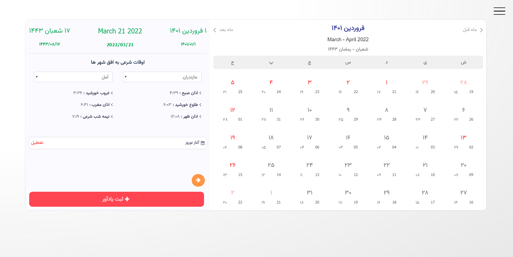
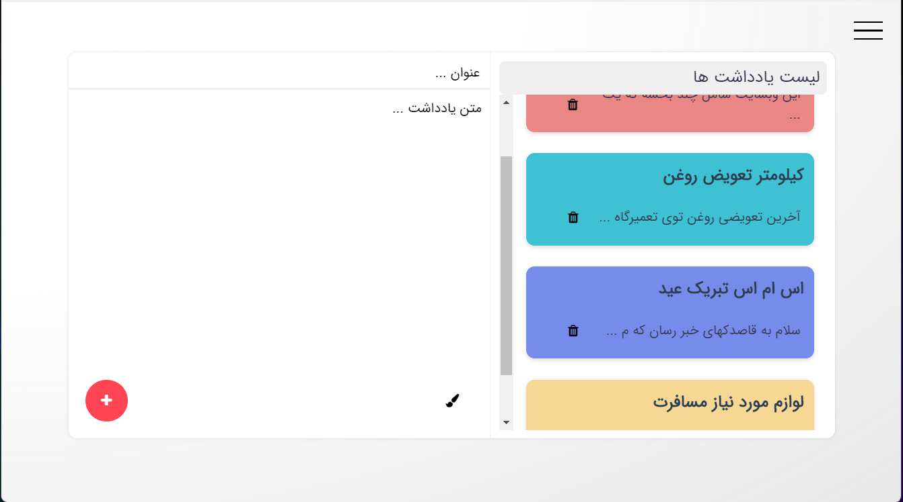
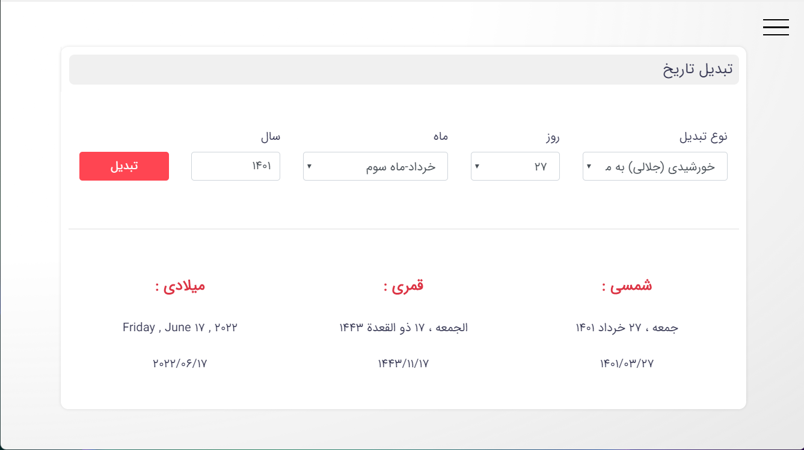

# Introduction


لوتوس یک دستیار رومیزی فارسی که برای سیستم عامل های ویندوز ، مک و لینوکس طراحی شده که شامل تقویم ، تبدیل تاریخ ، دفترچه
یادداشت و ... 

<p align="center">
    
</p>


### Screenshots
<p align="center">
    
</p>
<p align="center">
    
</p>
<p align="center">
    
</p>


### Build Setup

``` bash
# install dependencies
npm install

# serve with hot reload at localhost:9080
npm run dev

# build electron application for production
npm run build
```

### Changelog

Please see [CHANGELOG](changelog.md) for more information on what has changed recently.
