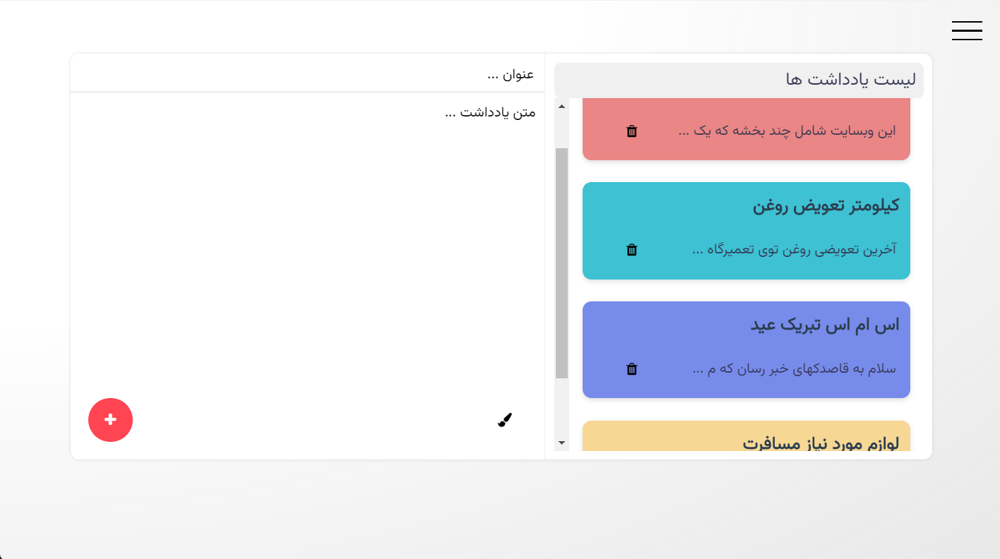
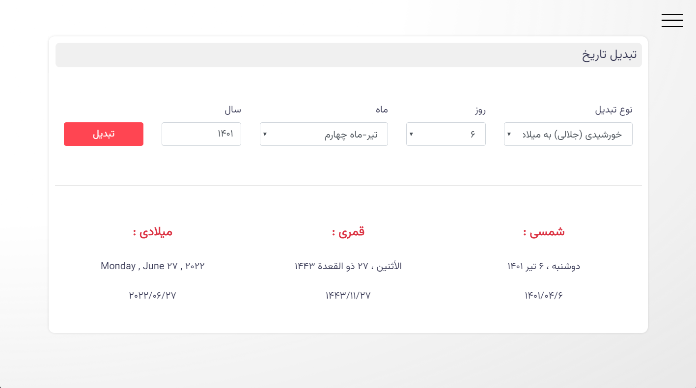

# معرفی


<p align="center">
    
</p>

لوتوس یک دستیار رومیزی فارسی که برای سیستم عامل های ویندوز ، مک و لینوکس طراحی شده که شامل تقویم ، تبدیل تاریخ ، دفترچه
یادداشت و ...

## دانلود

برای دانلود به صفحه [releases](https://github.com/rezaghz/loutos/releases) مراجعه کنید

## اسکرین شات ها

<p align="center">
    
</p>
<p align="center">
    
</p>
<p align="center">
    
</p>
<p align="center">
    
</p>

## نحوه Build

``` bash
# install dependencies
npm install

# serve with hot reload at localhost:9080
npm run dev

# build electron application for production
npm run build
```
## حمایت

<p align="center">
 <a href="https://daramet.com/rezaghz" target="_blank">
        
    </a>
</p>

<p align="center">
 <a href="https://yekpay.me/en/rezaghz" target="_blank">
        
    </a>
</p>


## لاگ تغییرات

شما میتونید [لاگ تغییرات](changelog.md) رو برای اطلاعات بیشتر و تغییرات اخیر مشاهده کنید

## مسیر پیشرفت

[مسیر پیشرفت](https://trello.com/b/90VwIm3M/loutos) لوتوس در ترلو ساخته شده شما میتونید اون رو مشاهده کنید 
